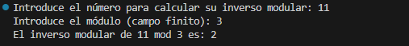
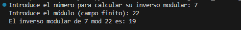

# Cálculo del Inverso Modular en un Campo Finito

Este repositorio contiene un programa en Python que calcula el inverso modular de un número dado un campo finito (módulo). El cálculo del inverso modular es fundamental en varias aplicaciones matemáticas y criptográficas, como en el cifrado RSA y la aritmética modular en general.

## Descripción

El inverso modular de un número \( a \) respecto a un módulo \( m \) es el número \( x \) que satisface la ecuación:

\[ a \cdot x \equiv 1 \ (\text{mod} \ m) \]

Este programa utiliza el **Algoritmo Extendido de Euclides** para calcular el inverso modular de manera eficiente, permitiendo que el usuario introduzca cualquier número y módulo.

### Algoritmo Utilizado

El **Algoritmo Extendido de Euclides** se usa para resolver la ecuación de Bezout:

\[ ax + my = \text{MCD}(a, m) \]

Si el MCD de \( a \) y \( m \) es 1, entonces existe un inverso modular, que es el valor de \( x \). El programa sigue los siguientes pasos:

1. Inicializa las variables de rastreo para los coeficientes de Bézout.
2. Usa un bucle para aplicar el algoritmo de Euclides, ajustando los coeficientes en cada iteración.
3. Si el inverso encontrado es negativo, se ajusta sumando el valor del módulo para obtener un resultado positivo.

## Uso

### Requisitos

- Python 3.x
- No requiere librerías externas.

### Ejecución

Para ejecutar el programa, sigue estos pasos:

1. Clona el repositorio:

   ```bash
   git clone https://github.com/usuario/inverso-modular.git

## Demostración



## Contacto

Para cualquier consulta o sugerencia, puedes contactar al desarrollador:

- **Nombre**: Adrian Martinez Martinez
- **Correo**: martinezmartinezaadrian@gmail.com
- **GitHub**: [ByTRAX78](https://github.com/ByTRAX78)